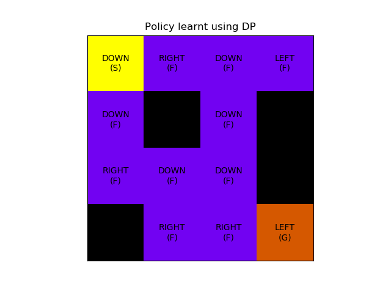

# Dynamic Programming based algorithms
This implementation covers tabular policy iteration and value iteration
## Background
Dynamic programming algorithms are planning based methods which evaluate all possible states in environment and learn a policy such that best states are selected. These methods require complete and accurate model of environment so that it can be exploited for planning. The two main algorithms based on dynamic programming are policy iteration and value iteration. Policy iteration is an iterative approach of evaluating policy followed by improvement in policy. However, it can be seen that fewer iterations of policy evaluation can be sufficient for agent to learn a good policy. So, value iteration improves policy after each policy evaluation step.  
The synchronous version of this algorithm involves sweeping through all states and updating the value functions in the end. However, this approach can be inefficient and so in asynchronous mode, agent updates value functions as it sweeps through the state space.

## Usage
Following command can be used to train agent, with default parameters using policy iteration in stochastic FrozenLake environment
```
python value_policy_iteration.py
```
Environment related arguments like environment name, rendering and deterministic can be specifed through command line, other training related parameters and directories can be specified through `config.yml` file

## Results and discussion
For this implementation, Frozen Lake environment was chosen for testing. It was expected that agent should be able to solve the deterministic version (no frozen blocks). Following was the policy learnt by agent and it can be seen that the agent manages to reach the goal state. 



Note that a stochastic environment will randomly yield next states from the frozen positions and so agent fails to learn a deterministic policy that can consistently solve the environment.