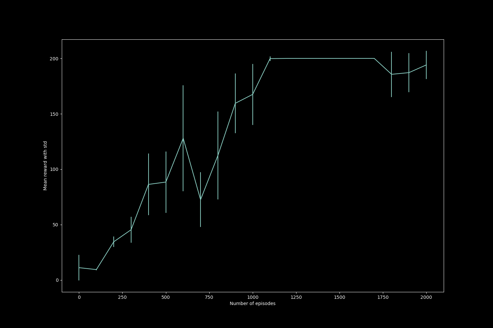
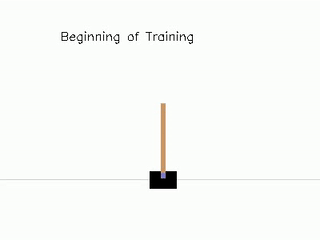
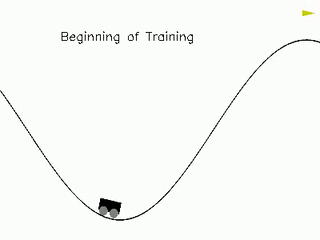

# Deep Q Networks
This implementation focuses on deep Q networks (DQN)

## Background
Deep Q networks introduce function approximators to the Q-learning algorithm. The tabular methods become infeasible for environments with continuous state space (which would have infinite possible states). The solution can thus be approximating the Q-value function with function approximator. DQN uses that idea to train neural network to predict Q-values given the state. However, the states observed (and hence the actions performed) in the course of an episode are correlated and also the Q-value targets to be learnt change as the agent learns. Due to these issues, a vanilla supervised training method cannot be used. Hence, DQN uses an experience replay memory in which state, action, rewards data is collected and neural network is trained on a randomly sampled batch to decorrelate the data points. The non-stationary targets issue is addressed by using a separate target network which is updated at a lesser frequency.  
There are some modifications to DQN algorithms that have been studied for improving performance. It was observed that DQN tends to learn over-optimistic estimates of Q-values as it uses same network to select and evaluate actions. Double DQN (https://arxiv.org/abs/1509.06461) proposes using separate networks for selecting and evaluating actions and hence uses the target network in DQN for evaluation. Another DQN variant was dueling networks (https://arxiv.org/abs/1511.06581) dividing Q-value prediction into state value function and action advantage function prediction. This approach enable agent to generalize learning across different actions

## Structure

```
.
├── config      # Folder to store config file
├── output      # Timestamped folders for runs containing logs and output artifacts
└── src
    └── *.py    # Source code files
```
## Usage
Train DQN agent using the following
```
python src/dqn_agent.py
```
Environment related arguments like environment name and rendering can be specifed through command line, other training related parameters and directories can be specified through `config.yml` file. The config file allows to select whether double DQN or dueling networks is to be used for training.
  
Run test functions with `pytest` for the implementation
```
pytest src/test.py
```

## Results and discussion
This implementation used the CartPole and MountainCar (discrete) environment to evaluate performance. 
The agent attempts to balance the pole by moving the cart in CartPole environment. The agent gets a reward of +1 for every step the pole is upright and the episode ends if the pole is more than 15 degrees from vertical or the cartpole moves out of the fixed region. The wiki defines "solving" CartPole as getting average reward of 195.0 over 100 consecutive trials. 
The progress of the agent is indicated by the following graph which plots average rewards obtained over 100 episodes against number of episodes that the agent is trained for.


The video snaps of the agent learning to balance the cartpole is indicated by the following gif.  
  
In the beginning, the pole collapses, later, the agent starts moving the cart in just one direction which results in either the pole falling off or the cart moving out of the fixed region. Finally, the agent learns to balance the pole for the required time.


In mountaincar, agent tries to reach top of the mountain with a car having a less powerful engine. The car cannot just accelerate and reach the top and hence has to acquire some momentum first to reach the goal eventually. The agent receives a reward of -1 for a time step until it manages to reach goal position of 0.5 and the episodee ends if goal is reached or 200 time steps have finished. The wiki defines "solving" MountainCar as getting average reward of -110.0 over 100 consecutive trials.
The video snaps of the agent learning to balance the cartpole is indicated by the following gif.  

  

In the beginning, the car just keeps firing engine to climb onto one side of mountain. Later, the agent learns to move back and forth but struggles to build the required momentum. Later the agent manages to reach the goal position, but the policy seems to be sub-optimal (as it acquires excessive momentum by reaching top of left side mountain). Finally, agent learns to get to the goal with just enough momentum.   
Note about mountaincar environment: The reward function for this environment is like a sparse reward function which makes it difficult for agent to learn.The agent relies completely on exploration through random actions to move towards the goal. 
It was observed that the performance of the agent would occasionally drop in between, through the course of training. This idea of "forgetting" through training was explained further at section 3.2 in https://arxiv.org/abs/1711.07478.
