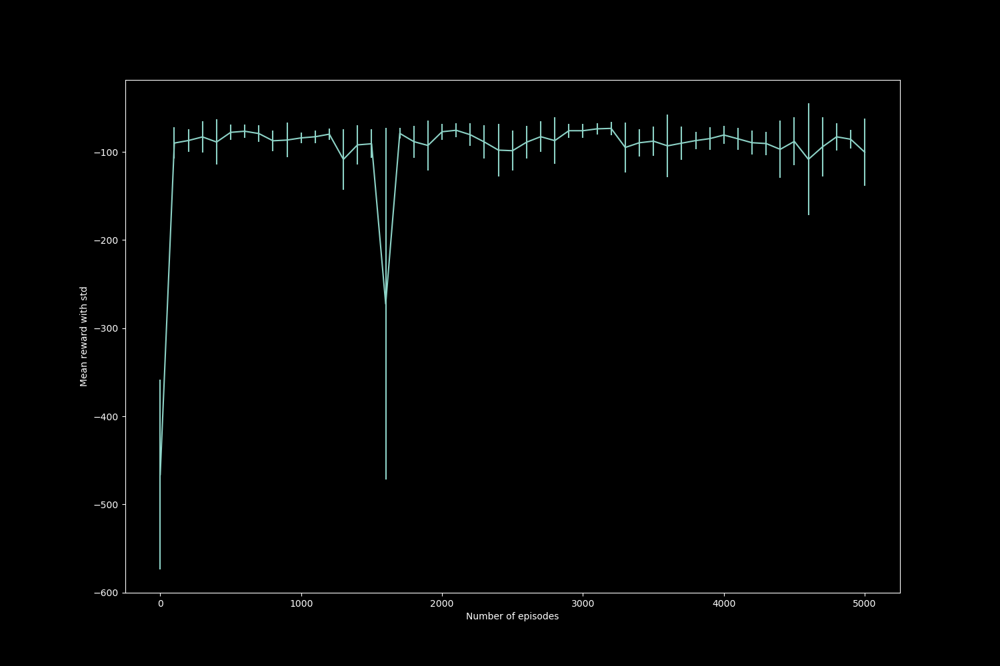
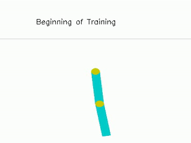
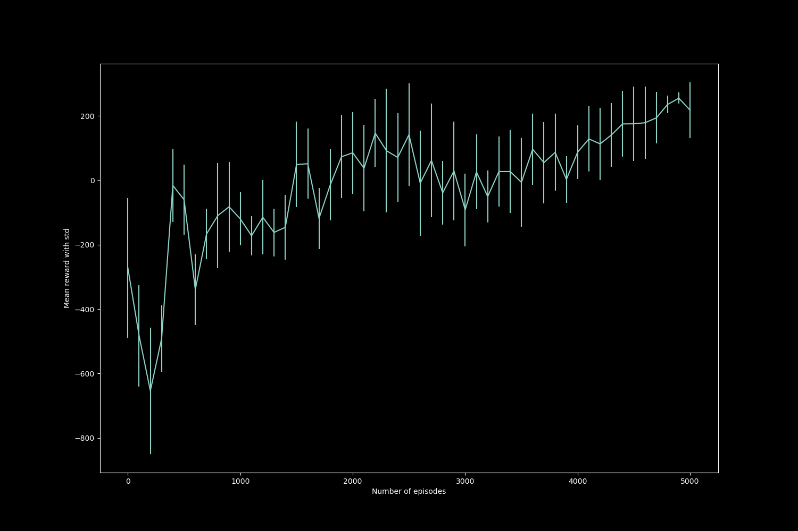

# Policy gradient algorithms
This implementation focuses on policy gradient algorithms like REINFORCE and Actor-Critic. The code supports vanilla REINFORCE, REINFORCE with baseline (value function) and actor critic using advantage function (with value function targets estimated by n-step returns)

## Background

Policy gradient algorithms optimize policy directly (as opposed to indirect approach of learning q-values and finding optimal policy). These methods parameterize policy with function approximators and train them with objective of maximizing expected future reward. These algorithms can be extended to learning stochastic policies by learning softmax probabilities in policy neural network as well as continuous actions. However, in the vanilla (gradient based) optimization setup, the states encountered and resulting rewards will change as parameters corresponding to policy are updated, making it difficult to optimize. This can be addressed with policy gradient theorem which eliminates dependence of gradient of expect future reward on states distribution.  
REINFORCE is a policy gradient algorithm which aims to learn an optimal policy by estimating expected returns through Monte Carlo sampling. This algorithm converges to optimal policy, but, suffers from high variance (due to Monte Carlo estimate). In order to address this issue, a baseline of state value function can be used to decrease variance. Note that this baseline does not increase bias but helps in decreasing variance (This blog explains in depth : https://danieltakeshi.github.io/2017/03/28/going-deeper-into-reinforcement-learning-fundamentals-of-policy-gradients/).  
Actor-critic is another policy gradient algorithm which extends REINFORCE with bootstrapping. This method uses a policy neural network and another neural network to approximate value function. Actor critic can use advantage function for estimating future rewards. It can be noted that TD error yields an unbiased estimate of advantage function and hence can be used to calculate policy gradients.
The optimization looks similar to REINFORCE with baseline but it can be observed that the expected future rewards computation is different (actor-critic uses bootstrapping introducing bias into estimate). The introduction of bias into actor-critic raises question of convergence of policy to optimal policy. It can be observed that under certain assumptions, the policy converges to optimal one. The conditions are that value function network should minimize mean squared error and gradient of value function should be equal to gradient of log probabilities of policy.  
Another variant of actor critic is using natural gradient which uses Fisher information matrix and enables to incorporate reparameterization of policies. (This variant has not been implemented)

## Structure

```
.
├── config      # Folder to store config file
├── output      # Timestamped folders for runs containing logs and output artifacts
└── src
    └── *.py    # Source code files
```
## Usage
Train policy gradients agent using the following
```
python src/pg_agent.py
```
Environment related arguments like environment name and rendering can be specifed through command line, other training related parameters and directories can be specified through `config.yml` file. The config file allows to specify whether REINFORCE, REINFORCE with baseline or actor-critic algorithm is to be used
  
Run test functions with `pytest` for the implementation
```
pytest src/test.py
```

## Results and discussion
This implementation used the Acrobot and Lunarlander (discrete) environment to evaluate performance. 

The acrobot system includes two joints and two links, where the joint between the two links is actuated. Initially, the links are hanging downwards, and the goal is to swing the end of the lower link up to a given height.

The acrobot environment consists of 2 links that can move about a joint. The agent attempts to raise the lowest point of the system to the goal position. As per wiki, "it does not have a specified reward threshold at which it's considered solved", but the trained agent seemed to attain the average best-100 epsiode performance reported on the leaderboard. 
This environment was trained using REINFORCE with baseline
The progress of the agent is indicated by the following graph which plots average rewards obtained over 100 episodes with standard deviation against number of episodes that the agent is trained for.
  

The video snaps of the agent interacting with acrobot is indicated by the following gif.  
  
In the beginning, the agent has a random policy and it moves the link in just one direction. Later the agent learns a suboptimal policy and so it takes more iterations. Finally, the agent seems to be completing the task in fewer iterations.


The lunarlander environment involves the agent attempting to land the lunarlander in the specified region. This agent was trained with actor-critic algorithm. This environment is considered solved after getting reward of 200.

The progress of the agent is indicated by the following graph which plots average rewards obtained over 100 episodes with standard deviation against number of episodes that the agent is trained for.
  


The video snaps of the agent interacting with acrobot is indicated by the following gif.  
  


In the beginning, agent has random policy and so it just crashes the lander. After some training, it learns to fire the engine but still struggles to land it properly. Later, the agent seems to be able to control the lander but fails to land in the specified area. Finally, the agent learns the optimal policy to land in the specified area.
